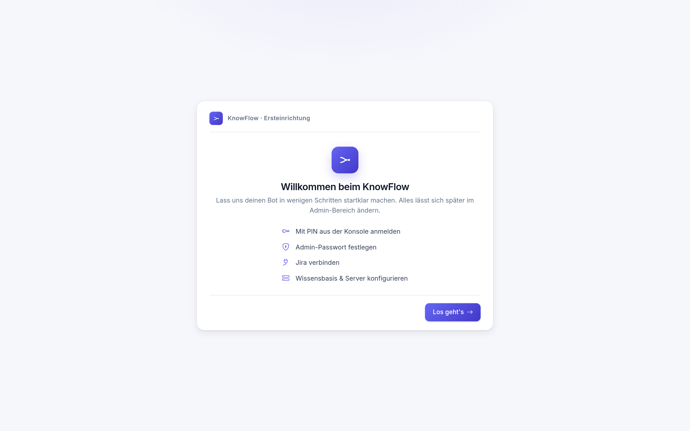

# KnowFlow

> **Erledigte Jira-Tickets werden automatisch zu durchsuchbarem Wissen** — für dein Team
> und für deine KI-Assistenten. Ohne zusätzliche Arbeit.

Sobald ein Ticket in Jira auf **„Erledigt"** wechselt, wird KnowFlow aktiv:

1. 📥 **Ticket einsammeln** — KnowFlow lädt das Ticket samt Lösung und Anhängen aus Jira.
2. 📝 **Wissensartikel erzeugen** — daraus entsteht ein sauberer Markdown-Artikel.
3. 📚 **Einsortieren** — der Artikel landet in deiner Wissensdatenbank ([Open WebUI](https://github.com/open-webui/open-webui)) und steht KI-Assistenten per [MCP](#-ki-assistenten-anbinden-mcp) zur Verfügung.

Als Bestätigung schreibt KnowFlow einen Kommentar zurück ins Jira-Ticket. Alles läuft
automatisch — gesteuert und überwacht über ein Web-Dashboard:


## ✨ Das kannst du damit machen

- **Wissen sichern, ohne etwas zu tun** — jedes erledigte Ticket wird automatisch zum
  nachschlagbaren Artikel. Niemand löst dasselbe Problem zweimal.
- **Live zuschauen** — das Dashboard zeigt in Echtzeit, welche Tickets gerade durch die
  Pipeline laufen, was erfolgreich war und wo es hakt.
- **Wissen gezielt verteilen** — mit Routing-Regeln („wenn Feld X = Y → Wissensbasis Z")
  landet jedes Thema in der richtigen Wissensbasis. Beliebig viele Ziele möglich.
- **KI-Assistenten anschließen** — über 6 eingebaute MCP-Verbindungen können Claude & Co.
  das Wissen durchsuchen, Artikel lesen und sogar Ungenauigkeiten zurück ans Ticket melden.
- **Alles im Browser verwalten** — Jira-Verbindung, Feld-Zuordnung, Regeln, Passwörter:
  alles im passwortgeschützten Admin-Bereich, nichts muss in Config-Dateien gepflegt werden.
- **Gefahrlos ausprobieren** — der eingebaute Dummy-Modus simuliert Open WebUI lokal.
  Zum Testen brauchst du weder eine echte Wissensdatenbank noch eine Jira-Instanz.

## 🚀 In 2 Minuten starten

Du brauchst nur **Node.js 20+** — keine Konfigurationsdateien, keine Vorbereitung:

```bash
git clone https://github.com/Mori-Takahashi/KnowFlow.git
cd KnowFlow
npm install
npm start
```

Dann <http://localhost:3000> öffnen. Beim ersten Start begrüßt dich der
**Setup-Assistent**, der dich durch alles führt (der Sicherheits-PIN dafür steht in der
Server-Konsole):



Alternativ mit **Docker**:

```bash
cp .env.example .env
docker compose up -d
```

Damit Jira echte Tickets schicken kann, brauchst du später noch einen Webhook —
die Schritt-für-Schritt-Anleitung steht in der [technischen Dokumentation](docs/TECHNIK.md#jira-webhook-einrichten).

## 🖥️ Ein Rundgang in Bildern

### Tickets im Blick

Jedes verarbeitete Ticket mit Status der 3-Schritt-Pipeline — inklusive Suche und Filter:


Die Detailansicht zeigt den Pipeline-Verlauf und den erzeugten Wissensartikel:


### Aktivitäts-Feed

Ein Live-Protokoll aller Vorgänge — wer hat was ausgelöst, was war erfolgreich, wo gab es Fehler:


### Die gesammelte Wissensbasis

Alle erzeugten Artikel mit Vorschau — synchron zu dem, was in Open WebUI liegt:


### 🤖 KI-Assistenten anbinden (MCP)

KnowFlow ist selbst ein **MCP-Server** (Model Context Protocol): Verbindungs-URL kopieren,
in Claude oder einem anderen MCP-Client als Connector eintragen — fertig. Der Assistent
kann dann live im Ticket-Wissen suchen und daraus antworten. Die Verbindung **All-in-One**
enthält alles, die Verbindungen 1–5 nur das, was du ihnen per Routing-Regel zuweist
(z. B. nur Support-Wissen für den Support-Bot). Auf Wunsch mit Login-Schutz (OAuth) oder
Zugriffs-Token.


### Verwaltung im Admin-Bereich

Jira-Verbindung, Feld-Zuordnung, Wissensbasen, Routing-Regeln, Zugriffsrechte und mehr —
alles zur Laufzeit änderbar:


## 📚 Mehr erfahren

| Dokument | Für wen? |
|---|---|
| [Was ist KnowFlow?](Was-ist-KnowFlow.md) | **Anwender:innen** — jeder Bereich der Oberfläche in Alltagssprache erklärt |
| [Technische Dokumentation](docs/TECHNIK.md) | **Admins & Entwickler:innen** — Installation, Konfiguration, Jira-Webhook, API, Troubleshooting |
| [Changelog](CHANGELOG.md) | Was ist neu in welcher Version? |
| [Contributing](CONTRIBUTING.md) · [Security](SECURITY.md) | Mitmachen & Sicherheitshinweise |

## Lizenz

ISC
