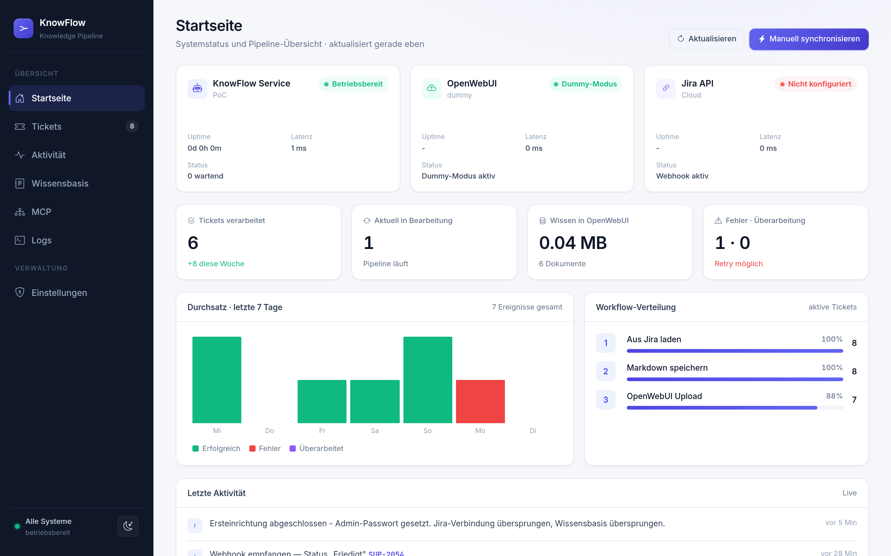
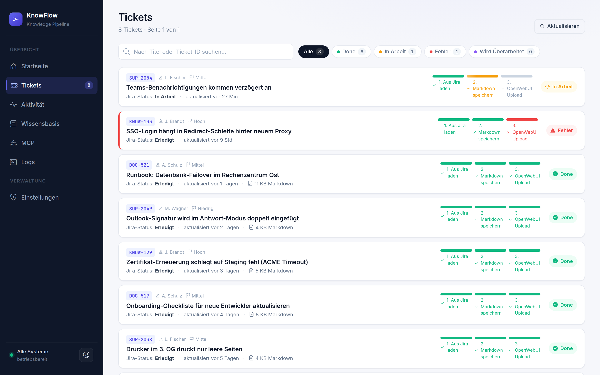
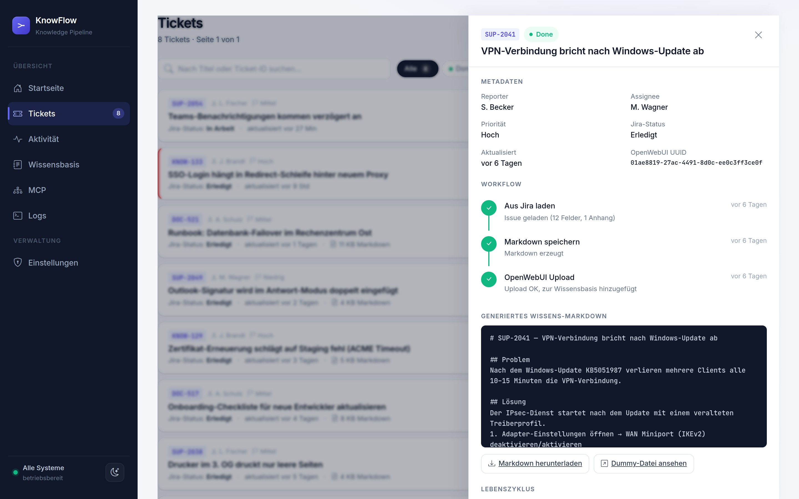
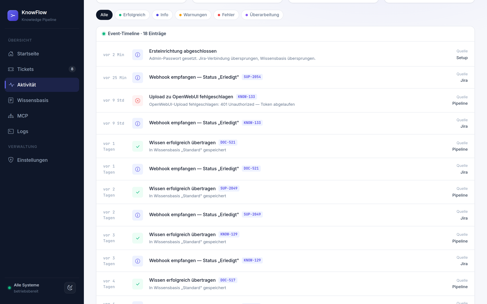
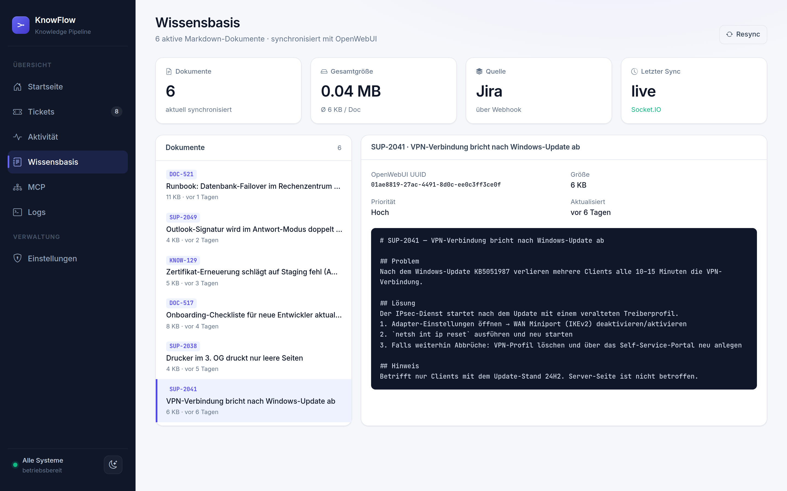
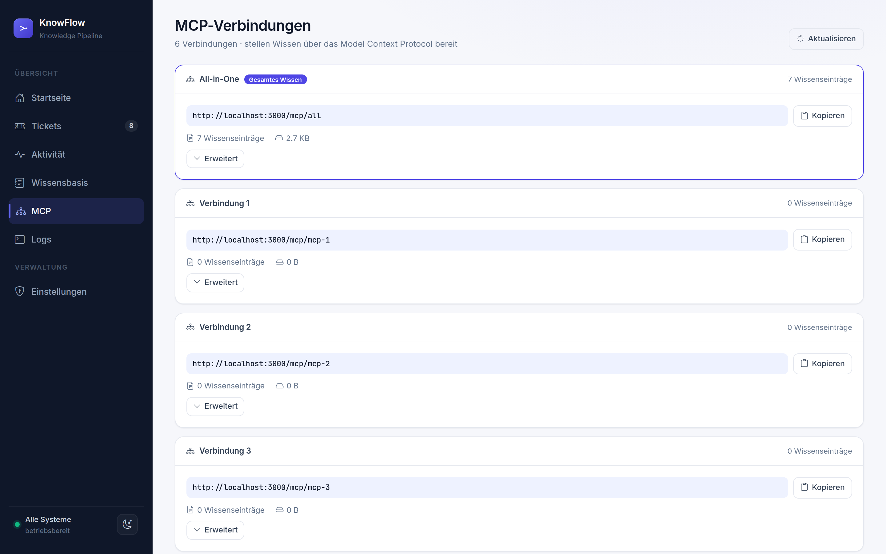
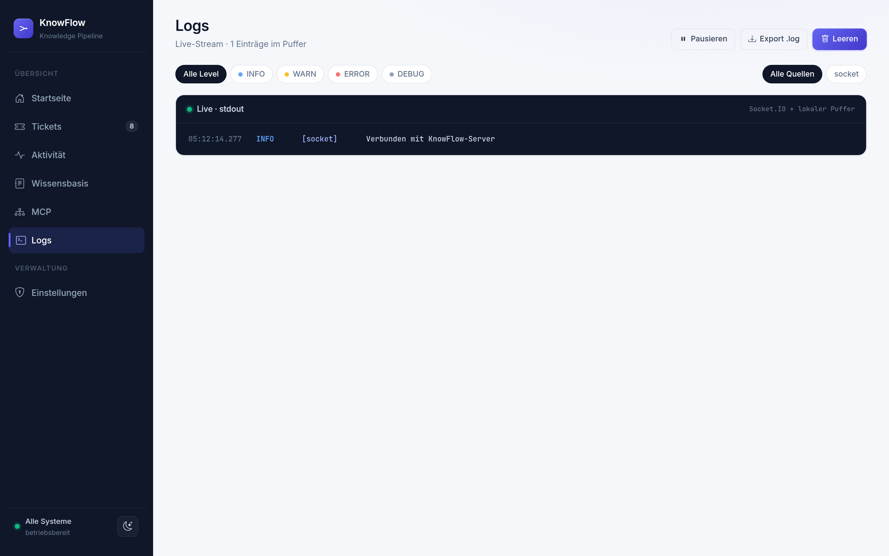
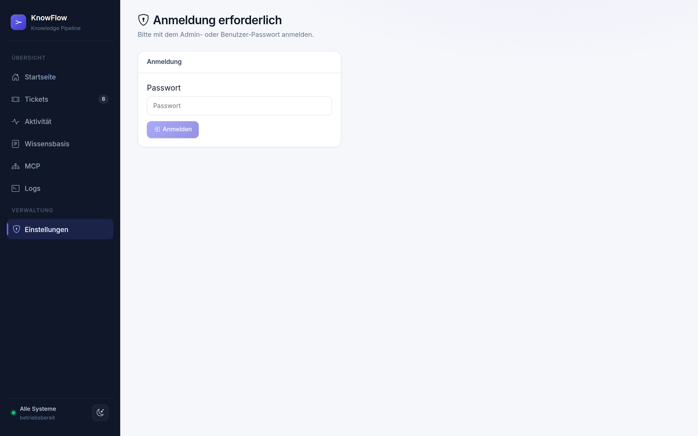
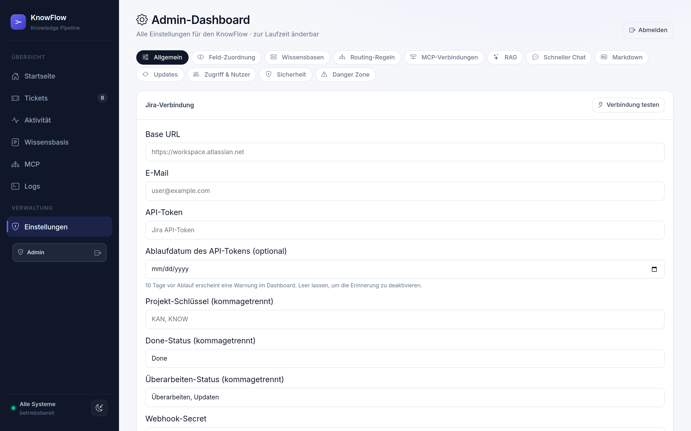

# 🤖 KnowFlow – Das Handbuch für Nutzer

> **In einem Satz:** Der KnowFlow verwandelt erledigte Jira-Tickets automatisch
> in nachschlagbares Wissen – damit niemand mehr dasselbe Problem zweimal lösen
> muss.

Diese Seite richtet sich an **alle Nutzerinnen und Nutzer** – nicht an
Programmierer. Sie erklärt in Alltagssprache, was der KnowFlow ist, was er für
Sie tut und führt Sie einmal durch **jeden Bereich** der Oberfläche.

---

## 📑 Inhalt

- [Warum gibt es den KnowFlow?](#warum-gibt-es-den-knowflow)
- [Wie der KnowFlow arbeitet](#wie-der-knowflow-arbeitet)
- [Das Dashboard im Überblick](#das-dashboard-im-überblick)
- [Die Bereiche im Detail](#die-bereiche-im-detail)
- [Die Einstellungen (für Administratoren)](#die-einstellungen-für-administratoren)
- [Besondere Funktion: Der MCP-Server](#-besondere-funktion-der-mcp-server)
- [Wofür der KnowFlow gut ist](#wofür-der-knowflow-gut-ist)
- [Häufige Fragen](#häufige-fragen)

---

## Warum gibt es den KnowFlow?

In vielen Teams werden Aufgaben, Fragen und Probleme in **Jira** verwaltet –
als sogenannte „Tickets". Wenn eine Aufgabe erledigt ist, steckt die **Lösung**
oft tief in einem alten Ticket. Wochen später hat jemand dasselbe Problem und
sucht stundenlang, weil das Wissen nirgends gebündelt ist. Oder die Lösung
gerät komplett in Vergessenheit.

> 💡 **Der KnowFlow sorgt dafür, dass dieses wertvolle Wissen nicht verloren
> geht** – ganz automatisch, ohne zusätzliche Arbeit für Sie.

---

## Wie der KnowFlow arbeitet

Sobald ein Ticket in Jira auf **„Erledigt"** gesetzt wird, wird der KnowFlow von
allein aktiv. Sie müssen **nichts** tun – kein Knopfdruck, kein Kopieren.

| Schritt | Was passiert | In einfachen Worten |
|:---:|---|---|
| **1** | Ticket aus Jira laden | Der KnowFlow sammelt alle Infos ein: Problem, Lösung, Anhänge. |
| **2** | Wissensartikel erstellen | Daraus entsteht ein sauberer, gut lesbarer Artikel. |
| **3** | Ins Nachschlagewerk einsortieren | Der Artikel landet in der durchsuchbaren Wissensdatenbank. |

Zusätzlich schreibt der KnowFlow einen **Kommentar zurück ins Jira-Ticket** – als
Bestätigung, dass die Lösung gesichert wurde, inklusive Link zum Dashboard.

---

## Das Dashboard im Überblick

Der KnowFlow hat eine eigene Internet-Oberfläche – das **Dashboard**. Hier sehen
Sie in Echtzeit, was gerade passiert. Über die **Seitenleiste links** wechseln
Sie zwischen den Bereichen.

Die Seitenleiste ist in zwei Gruppen geteilt:

| Gruppe | Bereiche |
|---|---|
| **Übersicht** | Startseite · Tickets · Aktivität · Wissensbasis · MCP · Logs |
| **Verwaltung** | Einstellungen _(passwortgeschützt)_ |

---

## Die Bereiche im Detail

### 🏠 Startseite

Ihr zentraler Überblick. Auf einen Blick sehen Sie:

- **Kennzahlen** – wie viele Tickets verarbeitet wurden, was gerade in Arbeit
  ist, wie viel Wissen gesammelt wurde und ob es Fehler gab.
- **Durchsatz** – ein Balkendiagramm, das die Aktivität der letzten Zeit zeigt.
- **Pipeline-Trichter** – wie viele Tickets gerade in welchem der drei Schritte
  stecken.
- **Systemstatus** – ob alle beteiligten Dienste (Jira, Wissensdatenbank)
  erreichbar sind.

---

### 🎫 Tickets

Die Liste **aller verarbeiteten Tickets**. Sie können suchen, filtern und ein
Ticket anklicken, um die Detailansicht zu öffnen.

In der Detailansicht sehen Sie das erzeugte Wissensdokument, die Anhänge und den
**Lebenszyklus** eines Tickets:

| Aktion | Bedeutung |
|---|---|
| **Aktiv** | Das Wissen ist live und in der Wissensdatenbank verfügbar. |
| **Veraltet (Obsolet)** | Das Wissen wird aus allen Zielen entfernt, das Ticket bleibt aber sichtbar. |
| **Löschen** | Das Wissen wird entfernt und das Ticket ausgeblendet. |
| **Reaktivieren** | Ein veraltetes/gelöschtes Ticket wird neu verarbeitet. |

> ℹ️ Die Lebenszyklus-Aktionen sind geschützt – man muss zuerst in den
> **Einstellungen** angemeldet sein.

---

### 📈 Aktivität

Ein **Live-Protokoll** aller Vorgänge: Welches Ticket wurde empfangen, welcher
Schritt war erfolgreich, wo gab es eine Warnung oder einen Fehler. Mit Filtern
nach **Erfolgreich, Info, Warnung, Fehler** und **Überarbeitung** behalten Sie
den Überblick.

---

### 📚 Wissensbasis

Hier sehen Sie **alle fertigen Wissensartikel**, die der KnowFlow erzeugt hat.
Links die Liste der Dokumente, rechts eine **Vorschau** des ausgewählten
Artikels. Oben stehen Kennzahlen wie Anzahl und Gesamtgröße der Dokumente.

---

### 🔗 MCP

Übersicht der **MCP-Verbindungen** – die Schnittstellen, über die KI-Assistenten
auf das gesammelte Wissen zugreifen. Hier kopieren Sie die Verbindungs-Adresse
und sehen, welches Wissen jede Verbindung enthält. → Mehr dazu im Abschnitt
[Der MCP-Server](#-besondere-funktion-der-mcp-server).

---

### 🖥️ Logs

Ein **Live-Mitschnitt** der technischen Meldungen des Dienstes – nützlich, wenn
einmal etwas nicht klappt. Man kann nach Wichtigkeit (Info, Warnung, Fehler)
filtern, den Stream pausieren und die Protokolle als Datei exportieren.

---

## Die Einstellungen (für Administratoren)

Der Bereich **Einstellungen** ist **passwortgeschützt** und richtet sich an die
Person, die den KnowFlow betreut. Hier wird alles eingerichtet und angepasst.
Oben wechselt man über Reiter (Tabs) zwischen den Themen.

| Tab | Wofür er da ist |
|---|---|
| **⚙️ Allgemein** | Verbindung zu Jira herstellen (Adresse, Konto, Projekte) und festlegen, welcher Status („Erledigt", „Fertig" …) den KnowFlow auslöst. |
| **🔤 Feld-Zuordnung** | Festlegen, welches Jira-Feld die Beschreibung, die Lösung, die Kategorie usw. enthält – damit der Artikel sauber aufgebaut wird. |
| **🗄️ Wissensbasen** | Die Ziele verwalten, in die Wissen geschrieben wird. Beliebig viele möglich, jedes mit Verbindungstest. |
| **🔀 Routing-Regeln** | Regeln nach dem Muster „**Wenn** Feld X = Wert Y → **dann** in Wissensbasis Z". So landet jedes Thema am richtigen Ort. Mit Live-Vorschau an echten Tickets. |
| **🌐 MCP-Verbindungen** | Titel und Beschreibung der sechs MCP-Verbindungen pflegen (siehe nächster Abschnitt). |
| **📝 Markdown** | Das Aussehen der erzeugten Artikel anpassen (Überschriften der Abschnitte). |
| **🔒 Sicherheit** | Das Admin-Passwort ändern. |
| **⚠️ Danger Zone** | Heikle Wartungsaktionen: Verarbeitung pausieren, Aktivität leeren, alle Tickets löschen, Konfiguration zurücksetzen, Dienst neu starten. Jede Aktion muss mit dem Passwort bestätigt werden. |

> ⚠️ **Danger Zone:** Aktionen hier sind – bis auf die Webhook-Pause – **nicht
> umkehrbar**. Bitte mit Bedacht nutzen.

---

## 🌐 Besondere Funktion: Der MCP-Server

Das ist eine der spannendsten Fähigkeiten des KnowFlows.

**MCP** steht für **Model Context Protocol**. Stark vereinfacht: ein
**standardisierter „Andockpunkt", an den sich KI-Assistenten und Chatbots
anschließen können**, um direkt auf das gesammelte Ticket-Wissen zuzugreifen.

> 💬 **So fühlt sich das an:** Statt selbst zu suchen, fragen Sie einfach Ihren
> KI-Assistenten – und der antwortet auf Basis des echten, geprüften Wissens aus
> Ihren erledigten Tickets. Inklusive Quellenangabe und passenden Anhängen.

**Was der MCP-Server kann:**

- Ein KI-Assistent kann das Wissen **durchsuchen**, einzelne Artikel **lesen**
  und **Anhänge** abrufen – live und immer aktuell.
- Es gibt **sechs feste Verbindungen**:

| Verbindung | Inhalt |
|---|---|
| **All-in-One** | Das gesamte Wissen aller aktiven Tickets. |
| **Verbindung 1–5** | Jeweils nur die Tickets, die per Routing-Regel zugeordnet wurden. |

So kann man z. B. einem Support-Chatbot nur das Support-Wissen geben und einem
internen Assistenten das gesamte Wissen – ganz nach Bedarf.

> ℹ️ Wird ein Ticket als veraltet markiert oder gelöscht, verschwindet es auch
> automatisch aus den MCP-Verbindungen. Das Wissen bleibt also immer aktuell.

---

## Wofür der KnowFlow gut ist

Der KnowFlow ist besonders nützlich für Teams, die …

- ✅ **immer wieder ähnliche Probleme** bearbeiten,
- ✅ **Wissen nicht verlieren** wollen, wenn jemand das Team verlässt,
- ✅ **neue Kolleginnen und Kollegen schneller einarbeiten** möchten,
- ✅ sich das **ständige Nachfragen** untereinander sparen wollen,
- ✅ eine **KI oder einen Chatbot** mit echtem Firmenwissen füttern möchten.

> **Vorher:** „Hatten wir dieses Problem nicht schon mal? … Keine Ahnung, wer
> das gelöst hat." *(30 Minuten später, immer noch keine Antwort.)*
>
> **Mit KnowFlow:** „Kurz in der Wissensdatenbank suchen … ah, hier – genau diese
> Lösung." *(Problem in 2 Minuten gelöst.)*

---

## Häufige Fragen

**Muss ich meine Arbeitsweise ändern?**
Nein. Sie arbeiten in Jira ganz normal weiter. Sobald ein Ticket auf „Erledigt"
steht, erledigt der KnowFlow den Rest von allein.

**Geht dabei etwas in Jira verloren oder kaputt?**
Nein. Der KnowFlow **liest** die Tickets nur und fügt einen freundlichen
Bestätigungs-Kommentar hinzu. Ihre Tickets bleiben unverändert.

**Wer kann auf das gesammelte Wissen zugreifen?**
Alle, die Zugriff auf die Wissensdatenbank haben – sowie KI-Assistenten, die
über den MCP-Server verbunden sind. Die Zugriffsrechte legen Ihre
Administratoren fest.

**Wer richtet das ein?**
Die einmalige Einrichtung übernimmt eine technisch versierte Person über die
geschützten **Einstellungen**. Danach läuft alles automatisch.

---

> 📄 _Diese Seite beschreibt den KnowFlow aus Anwendersicht. Technische Details,
> die Installation und alle Konfigurations-Variablen finden technische Nutzer in
> der [technischen Dokumentation](docs/TECHNIK.md)._
